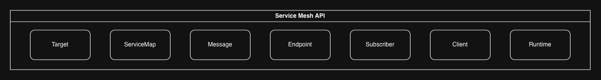
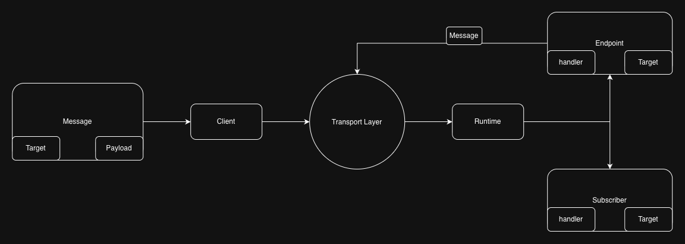

# Service Mesh API Specification

The Service Mesh API Specification is a contract between application code and a transport-specific 
runtime designed to make implementing a service mesh architecture easier and more straightforward. It
does this by cleanly separating the concerns of transport logic and application layer protocols, enabling
each aspect of the service mesh to change independently. In this way, a service mesh can be implemented 
using a single protocol, but multiple transport mechanisms to suit different purposes. In this case, it
would look nearly identical from each service's standpoint, as their bespoke code would be consuming the
same API contract no matter what transport was being used. Or, it may be implemented with multiple protocols, 
in which case only the higher level encoding/decoding would look different, and the transport layer could be 
reused.

## Core Concepts

The core concepts defined by this api specification are as follows. Type names and member names should be 
adhered to for each individual implementation in order to support interoperability.

| type         | members                                                                               |
|--------------|---------------------------------------------------------------------------------------|
| `Target`     | `segments: Array<String>`, `kind: :route \| :topic`, `metadata: Hash<String, String>` |
| `ServiceMap` | `targets: Array<Target>`, every available Target in the mesh.                         |
| `Message`    | `target: Target`, `metadata: Hash<String, String>`, `payload: Array<Byte>`            |
| `Endpoint`   | `target: Target`, `metadata: Hash<String, String>`, `handler: (Message) -> Message`   |
| `Subscriber` | `target: Target`, `metadata: Hash<String, String>`, `handler: (Message) -> nil`       |
| `Client`     | The client access points for the transport layer.                                     |
| `Runtime`    | The service process for async request handling.                                       |





### Target

A `Target` identifies some receiving channel or entity on the service mesh. It can be a pub/sub topic, a named work queue, 
or a specific route to an endpoint, and its final shape is dictated by the transport mechanism. It is represented by an 
array of strings called `segments`, and each transport specific implementation is required to assemble those strings 
appropriately to meet its own needs. For example, a NATS implementation might concatenate the segments with "." as 
the separator to form a valid NATS topic, while an HTTP implementation might use "/" to form a valid URL path.

Each `Target` also declares its `kind`, which is either `route` or `topic`. A `Target` with `kind = route` is one
that replies to requests with a reply message. A `Target` with `kind = topic` is one that does not reply.

A `Target` also contains a `Hash<String, String>` metadata object to hold transport specific configuration.

### ServiceMap

A `ServiceMap` is simply a list of all the available `Targets` on the service mesh. How it is constructed and how
service discovery is handled is left to the consumer of this API to determine. All this specification wants to know 
are what `Targets` are available and what kind they are.

### Message

A `Message` is the thing that gets sent back and forth between services. It contains a `Target`, a generic 
`Hash<String, String>` object for metadata and any runtime specific parameters, and a payload in the form of
an array of `Bytes` (or its equivalent for whichever language the implementation is in). This API specification 
does not serialize or deserialize messages, but sends and receives raw bytes, leaving the encoding and decoding
up to the consumer.

*Note: raw bytes may take different forms in different languages. For example, in Ruby it would be a `String` 
with `Encoding::BINARY`, but in Go it would be a `[]Byte`*

### Endpoint

An `Endpoint` is the pairing of a `Target` with `kind = route` and a message handler that responds to requests to 
that `Target`. The handler must receive a `Message` and return a `Message` as the reply to the request. `Endpoints`
also contain a metadata object, which can be used for transport specific settings.

### Subscriber

A `Subscriber` is the pairing of a `Target` with `kind = topic` and a message handler that responds to requests to
that `Target`. The handlers must receive a `Message` and return nothing. `Subscribers`
also contain a metadata object, which can be used for transport specific settings.

### Client

A `Client` accepts a `Hash<String, String>` for configuration upon construction and provides access to the underlying transport mechanism, 
allowing clients on the service mesh to make requests. It exposes the following methods:

* Request: Accepts a `Message` and a `Hash<String, String>` for transport specific options. Returns a `Message` in reply.
* Publish: Accepts a `Message` and a `Hash<String, String>` for transport specific options. Returns nothing.

A concrete `Client` implementation is transport-specific, and should not be used to make requests or to publish messages
against a `Target` that is not available on its specific transport. 

### Runtime

A `Runtime` accepts a `Hash<String, String>` for configuration upon creation, as well as a `ServiceMap`, a list of 
`Endpoints`, and a list of `Subscribers`. It also contains a `Client`.

A `Runtime` is bound to one transport mechanism, so everything passed to it must be available on that transport. The 
`ServiceMap` it receives should hold only the `Targets` reachable over that transport, and the `Endpoints` and `Subscribers` 
are only those served over it by the containing service. A process that uses more than one transport constructs one `Runtime` 
per transport, each with its own subset, but uses them through the common interface. A `Runtime` should never be given a 
`Target` that is meant to be accessed on a different transport.

The `Runtime` provides the async process for handling the containing service's requests. It exposes three 
lifecycle methods:

* Start: Connects, binds every `Endpoint` and `Subscriber`, and begins receiving.
* Stop: Accepts a drain duration as a non-negative `Float` of seconds. Stops receiving, waits up to that long for in-flight handlers to finish, then 
  closes. Handlers still running at the end of the drain are abandoned.
* Running: Returns whether `Start` has succeeded and `Stop` has not run.

A `Runtime` is not restartable. Calling `Start` after `Stop` is an error the implementation defines. Signal 
handling and process management wrap a `Runtime` and are outside this contract.

## Configuration

Because each transport mechanism will require its own, unique configuration schema, this specification provides only a
`Hash<String, String>` for carrying those values, either as metadata passed through the interfaces described above or as 
global configuration, and defines only transport-agnostic configuration itself.

The transport-agnostic configuration is as follows:

* `deployment_group`: This configuration provides the global, logical group that a service on the service mesh belongs to. 
  It can group instances of a single service, allowing the transport layer to decide for itself how to handle duplicate 
  instances of the same handlers, or it can simply tell the transport layer something about where it will be receiving 
  requests. In practice, this can be a shared base URL for HTTP based Services (in which case it probably won't 
  need to worry about duplicate handlers), a Queue Group for NATS based services, and so on. `deployment_group` should be 
  included in the configuration passed to the `Runtime` on the server side or to each `Target` on the client side, 
  as required by the transport specific implementation.

  A `deployment_group` is also the unit of transport selection. Every `Target` in a deployment group is served over one 
  transport, and a `Runtime` serves one deployment group. The mapping from a deployment group to a transport is owned by 
  the layer above this specification, which is why a `Target` carries `deployment_group` in its metadata: a caller 
  reads it to choose the `Client` for that transport, and a `Runtime` is handed only the `Endpoints`, `Subscribers`, 
  and `ServiceMap` of its own deployment group.
* `consumer_group`: This configuration provides a per `Target` logical group for a service's Endpoints and Subscribers to belong
  to, in order to control the cardinality between producers and consumers on the service mesh more directly. By default, 
  both Endpoints and Subscribers should use the containing service's `deployment_group` as their `consumer_group`, but a 
  transport specific implementation may allow this to be overridden by passing `consumer_group` on the metadata of any given
  `Target`, `Endpoint` or `Subscriber` (depending on how the transport logic needs to access it). When this configuration 
  is used, the value `"none"` should mean that there should be no logical group (nullifying the `deployment_group` default 
  if applied). With `consumer_group` set to "none", an Endpoint or Subscriber should handle all messages sent to its Target, 
  regardless if it has duplicate instances running, and it should be expected for all instances to do so. With any other value, 
  it should be expected that only one handler within the designated logical group will handle any given message (though handlers 
  outside that group may still handle it if they have the same `Target`).

## Errors

The contract defines three errors, all raised for misuse of the contract.

| error               | raised when                                                                                                                                       |
|---------------------|---------------------------------------------------------------------------------------------------------------------------------------------------|
| `KindMismatch`      | a `Target`'s kind does not match its use: `Request` with a `topic`, `Publish` with a `route`, an `Endpoint` on a `topic`, a `Subscriber` on a `route` |
| `InvalidTarget`     | a `Target`'s segments cannot be carried by the transport                                                                                          |
| `NoDeploymentGroup` | `Runtime` is constructed without `config["deployment_group"]`                                                                                     |

Transport errors, timeouts, and connection failures are the transport specific implementation's own exceptions and pass 
through unchanged. Each implementation should document what it does when a handler raises.

## Implementations

- Go contract: [service-mesh-go](https://github.com/Paymentbox-com/service-mesh-go), module `github.com/Paymentbox-com/service-mesh-go`, imported as `github.com/Paymentbox-com/service-mesh-go/mesh`.
- Go transport over NATS: [service-mesh-nats-go](https://github.com/Paymentbox-com/service-mesh-nats-go), module `github.com/Paymentbox-com/service-mesh-nats-go`, package `nats`.
- Ruby contract: [service-mesh-ruby](https://github.com/Paymentbox-com/service-mesh-ruby), gem `service_mesh`, module `ServiceMesh`, with a conformance suite transports run.
- Ruby transport over NATS: [service-mesh-nats-ruby](https://github.com/Paymentbox-com/service-mesh-nats-ruby), gem `service_mesh_nats`.

Registering an endpoint and making a request looks like this in each.

```go
import (
    "github.com/Paymentbox-com/service-mesh-go/mesh"
    "github.com/Paymentbox-com/service-mesh-nats-go/nats"
)

echo := mesh.Target{Segments: []string{"demo", "echo"}, Kind: mesh.KindRoute}
cfg := mesh.Config{nats.URLKey: "nats://127.0.0.1:4222", mesh.DeploymentGroupKey: "demo"}

rt, err := nats.New(cfg, mesh.ServiceMap{Targets: []mesh.Target{echo}},
    []mesh.Endpoint{{Target: echo, Handler: func(ctx context.Context, m mesh.Message) (mesh.Message, error) {
        return mesh.Message{Payload: m.Payload}, nil
    }}}, nil)
err = rt.Start(ctx)

reply, err := rt.Client().Request(ctx, mesh.Message{Target: echo, Payload: []byte("hi")}, nil)
```

```ruby
require "service_mesh_nats"

echo = ServiceMesh::Target.new(segments: %w[demo echo], kind: :route)
config = {"url" => "nats://127.0.0.1:4222", "deployment_group" => "demo"}

runtime = ServiceMeshNats::Runtime.new(config, ServiceMesh::ServiceMap.new(targets: [echo]),
  endpoints: [ServiceMesh::Endpoint.new(target: echo, handler: ->(m) {
    ServiceMesh::Message.new(target: echo, payload: m.payload)
  })])
runtime.start

reply = runtime.client.request(ServiceMesh::Message.new(target: echo, payload: "hi"))
```
