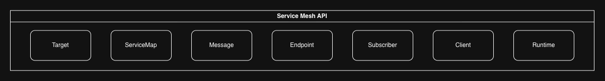
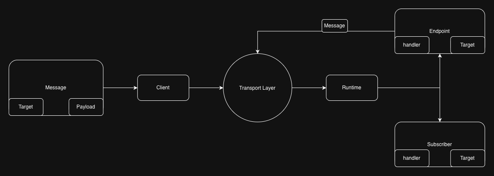

# Service Mesh API Specification

The Service Mesh API Specification is a contract between application code and a transport-specific 
runtime designed to make implementing a service mesh architecture easier and more straightforward. It
does this by cleanly separating the concerns of transport logic and application layer protocols, enabling
each aspect of the service mesh to change independently. Using this specification, a service mesh can be implemented 
using a single protocol, but multiple transport mechanisms to suit different purposes. This would enable things 
to look nearly identical from each service's standpoint, as their bespoke application code would be consuming the
same API contract no matter what transport was being used. Or, services may be implemented with multiple protocols, 
in which case only the higher level encoding/decoding would look different, and the transport layer could be 
reused.

## Core Concepts

The core concepts defined by this api specification are as follows. Type names and member names should be 
adhered to for each individual implementation in order to support interoperability.

| type         | members                                                                               |
|--------------|---------------------------------------------------------------------------------------|
| `Target`     | `segments: Array<String>`, `kind: :route \| :topic`, `metadata: Hash<String, String>` |
| `ServiceMap` | `targets: Array<Target>`, every available Target in the mesh.                         |
| `Message`    | `target: Target`, `metadata: Hash<String, String>`, `payload: Array<Byte>`            |
| `Endpoint`   | `target: Target`, `metadata: Hash<String, String>`, `handler: (Message) -> Message`   |
| `Subscriber` | `target: Target`, `metadata: Hash<String, String>`, `handler: (Message) -> nil`       |
| `Client`     | The client access points for the transport layer.                                     |
| `Runtime`    | The service process for async request handling.                                       |





### Target

A `Target` identifies some receiving channel or entity on the service mesh. It can be a pub/sub topic, a named work queue, 
or a specific route to an endpoint, and its final shape is dictated by the transport mechanism. It is represented by an 
array of strings called `segments`, and each transport specific implementation is required to assemble those strings 
appropriately to meet its own needs. For example, a NATS implementation might concatenate the segments with "." as 
the separator to form a valid NATS topic, while an HTTP implementation might use "/" to form a valid URL path.

Each `Target` also declares its `kind`, which is either `route` or `topic`. A `Target` with `kind = route` is one
that replies to requests with a reply message. A `Target` with `kind = topic` is one that does not reply.

A `Target` also contains a `Hash<String, String>` metadata object to hold transport specific configuration. A `Target`
is an address, used alike by the clients that send to it and the `Endpoints` and `Subscribers` that receive from it, so
its metadata holds only addressing. It never carries `deployment_group` or `consumer_group`, which describe receivers, as
described under [Configuration](#configuration).

### ServiceMap

A `ServiceMap` is simply a list of all the available `Targets` on the service mesh. How it is constructed and how
service discovery is handled is left to the consumer of this API to determine. All this specification wants to know 
are what `Targets` are available and what kind they are.

### Message

A `Message` is the thing that gets sent back and forth between services. It contains a `Target`, a generic 
`Hash<String, String>` object for metadata and any runtime specific parameters, and a payload in the form of
an array of `Bytes` (or its equivalent for whichever language the implementation is in). This API specification 
does not serialize or deserialize messages, but sends and receives raw bytes, leaving the encoding and decoding
up to the consumer. Metadata keys that start with `Mesh-` are reserved, as described under [Metadata](#metadata).

Both a `Message`'s metadata and its payload should be sent on the transport layer, in whatever way is most 
appropriate for that transport layer.

*Note: raw bytes may take different forms in different languages. For example, in Ruby it would be a `String` 
with `Encoding::BINARY`, but in Go it would be a `[]Byte`*

### Metadata

The `Mesh-` prefix is reserved in all `Message` metadata for transport and protocol layers, and should not be used by
application business logic.

A key that starts with `Mesh-` and does not name a transport is defined by this specification or by a protocol layer's
specification, and means the same thing on every transport.

A key a transport defines for itself starts with `Mesh-` followed by the transport's name, such as `Mesh-Nats-`, so
keys from two transports never collide.

This specification defines the following keys. A transport may use any of them. A transport that uses one follows the
meaning and format given here.

| key                     | set by                                                     | meaning and format                                                                                                                                                                                                        |
|-------------------------|------------------------------------------------------------|---------------------------------------------------------------------------------------------------------------------------------------------------------------------------------------------------------------------------|
| `Mesh-Handler-Error`    | the serving transport on a reply                           | The `Endpoint`'s handler failed. The value is the failure's text.                                                                                                                                                        |
| `Mesh-Timeout`          | the requesting transport on a request                      | How long the caller waits for the reply, as a whole number of milliseconds. It is relative, so it does not depend on the hosts' clocks agreeing.                                                                         |
| `Mesh-Deadline`         | the receiving transport on a message it hands to a handler | When the handler's result stops mattering, in RFC 3339 with fractional seconds. For a request it is the arrival time plus `Mesh-Timeout`. For a delivery that is sent again unless acked, it is the redelivery time. |
| `Mesh-Delivery-Attempt` | the receiving transport on a message it hands to a handler | Which delivery of the message this is, starting at 1. Absent when the transport does not track deliveries.                                                                                                                |
| `Mesh-Message-Id`       | the publisher or caller                                    | An ID that stays the same when the same message is sent again, so handlers can recognize repeats.                                                                                                                         |

A transport does not define a key of its own for something one of these keys already covers. When the transport has a
native field with the same meaning, it treats the native field and the metadata field defined here as one field. When
sending, the metadata field defined here wins, and the transport sets the native field from it. When receiving, the
native field wins, and the transport sets the metadata field defined here from it.

### Endpoint

An `Endpoint` is the pairing of a `Target` with `kind = route` and a message handler that responds to requests to 
that `Target`. The handler must receive a `Message` and return a `Message` as the reply to the request. `Endpoints`
also contain a metadata object, which can be used for transport specific settings and holds the `Endpoint`'s
`consumer_group`.

### Subscriber

A `Subscriber` is the pairing of a `Target` with `kind = topic` and a message handler that responds to requests to
that `Target`. The handlers must receive a `Message` and return nothing. `Subscribers`
also contain a metadata object, which can be used for transport specific settings and holds the `Subscriber`'s
`consumer_group`.

### Client

A `Client` accepts a `Hash<String, String>` for configuration upon construction, as well as a `ServiceMap` holding only the 
`Targets` reachable over its transport. It holds that `ServiceMap` and exposes it. A `Client` provides access to the underlying 
transport mechanism, allowing clients on the service mesh to make requests. It exposes the following methods:

* Request: Accepts a `Message` and a `Hash<String, String>` for transport specific options. Returns a `Message` in reply.
* Publish: Accepts a `Message` and a `Hash<String, String>` for transport specific options. Returns nothing.
* Close: Releases the `Client`'s connection. A `Client` that has been closed accepts no further requests. A `Client` 
  given to a `Runtime` is the `Runtime`'s connection, and the `Runtime`'s Stop closes it.

A concrete `Client` implementation is transport-specific, and should not be used to make requests or to publish messages
against a `Target` that is not in its `ServiceMap`. 

### Runtime

A `Runtime` accepts a `Client` upon creation, together with a `Hash<String, String>` for configuration, a list of 
`Endpoints`, and a list of `Subscribers`. The `Client` is the `Runtime`'s connection to the transport: the application 
constructs it, the `Runtime` subscribes each of its `Endpoints` and `Subscribers` on it, and the `Runtime`'s `ServiceMap` is the 
`Client`'s. The `Runtime` exposes that `Client`, and Stop closes it.

A `Runtime` is bound to one transport mechanism, so everything passed to it must be available on that transport. The 
`ServiceMap` of its `Client` holds only the `Targets` reachable over that transport, and the `Endpoints` and `Subscribers` 
are only those served over it by the containing service. A process that uses more than one transport constructs one `Runtime` 
per transport, each with its own subset, but uses them through the common interface. A `Runtime` should never be given a 
`Target` that is meant to be accessed on a different transport.

The `Runtime` provides the async process for handling the containing service's requests. It exposes three 
lifecycle methods:

* Start: Subscribes every `Endpoint` and `Subscriber` on the `Client`'s connection and begins receiving.
* Stop: Accepts a drain duration as a non-negative `Float` of seconds. Stops receiving, waits up to that long for in-flight handlers to finish, then 
  closes the `Client`. Handlers still running at the end of the drain are abandoned.
* Running: Returns whether `Start` has succeeded and `Stop` has not run.

A `Runtime` is not restartable. Calling `Start` after `Stop` is an error the implementation defines. Signal 
handling and process management wrap a `Runtime` and are outside this contract.

## Configuration

Because each transport mechanism will require its own, unique configuration schema, this specification provides only a
`Hash<String, String>` for carrying those values, either as metadata passed through the interfaces described above or as 
global configuration, and defines only transport-agnostic configuration itself.

The transport-agnostic configuration is as follows:

* `deployment_group`: This configuration provides the global, logical group that a running service belongs to. It
  groups the instances of a single service, allowing the transport layer to decide for itself how to handle duplicate
  instances of the same handlers. In practice, this can be a shared base URL for HTTP based services, a Queue Group for
  NATS based services, and so on.

  `deployment_group` is configuration of the `Runtime`, and nothing else carries it. `Targets`, `Endpoints`, and
  `Subscribers` do not. Every `Runtime` requires it, and a `Runtime` constructed without it raises `NoDeploymentGroup`.
  It is the default `consumer_group` of every `Endpoint` and `Subscriber` the `Runtime` serves.
* `consumer_group`: This configuration provides the logical group an `Endpoint` or `Subscriber` belongs to, in order to
  control the cardinality between producers and consumers on the service mesh more directly. It is metadata on the
  `Endpoint` or `Subscriber`, not on its `Target`, because one `Target` can have many receivers, each in its own group.
  A transport resolves the group of each `Endpoint` and `Subscriber` as follows:

  1. The `Endpoint`'s or `Subscriber`'s `consumer_group` metadata, if it is set and not empty.
  2. Otherwise the `Runtime`'s `deployment_group`.

  The value `"none"` means there is no logical group. An `Endpoint` or `Subscriber` in no group handles all messages
  sent to its `Target`, even when it has duplicate instances running, and all instances are expected to do so. With any
  other value, only one handler within the group handles any given message, while handlers in other groups with the
  same `Target` also receive it.

## Errors

The contract defines three errors, all raised for misuse of the contract.

| error               | raised when                                                                                                                                       |
|---------------------|---------------------------------------------------------------------------------------------------------------------------------------------------|
| `KindMismatch`      | a `Target`'s kind does not match its use: `Request` with a `topic`, `Publish` with a `route`, an `Endpoint` on a `topic`, a `Subscriber` on a `route` |
| `InvalidTarget`     | a `Target`'s segments cannot be carried by the transport                                                                                          |
| `NoDeploymentGroup` | `Runtime` is constructed without `config["deployment_group"]`                                                                                     |

Transport errors, timeouts, and connection failures are the transport specific implementation's own exceptions and pass 
through unchanged. A transport may report a failed `Endpoint` handler by setting `Mesh-Handler-Error` on the reply, as
described under [Metadata](#metadata). Each implementation should document what it does when a handler raises.

## Implementations

- Go contract: [service-mesh-go](https://github.com/Paymentbox-com/service-mesh-go), module `github.com/Paymentbox-com/service-mesh-go`, imported as `github.com/Paymentbox-com/service-mesh-go/mesh`.
- Go transport over NATS: [service-mesh-nats-go](https://github.com/Paymentbox-com/service-mesh-nats-go), module `github.com/Paymentbox-com/service-mesh-nats-go`, package `nats`.
- Ruby contract: [service-mesh-ruby](https://github.com/Paymentbox-com/service-mesh-ruby), gem `service_mesh`, module `ServiceMesh`, with a conformance suite transports run.
- Ruby transport over NATS: [service-mesh-nats-ruby](https://github.com/Paymentbox-com/service-mesh-nats-ruby), gem `service_mesh_nats`.

Registering an endpoint and making a request looks like this in each.

```go
import (
    "github.com/Paymentbox-com/service-mesh-go/mesh"
    "github.com/Paymentbox-com/service-mesh-nats-go/nats"
)

echo := mesh.Target{Segments: []string{"demo", "echo"}, Kind: mesh.KindRoute}
cfg := mesh.Config{nats.URLKey: "nats://127.0.0.1:4222", mesh.DeploymentGroupKey: "demo"}

client, err := nats.NewClient(cfg, mesh.ServiceMap{Targets: []mesh.Target{echo}})
rt, err := nats.New(client, cfg,
    []mesh.Endpoint{{Target: echo, Handler: func(ctx context.Context, m mesh.Message) (mesh.Message, error) {
        return mesh.Message{Payload: m.Payload}, nil
    }}}, nil)
err = rt.Start(ctx)

reply, err := rt.Client().Request(ctx, mesh.Message{Target: echo, Payload: []byte("hi")}, nil)
```

```ruby
require "service_mesh_nats"

echo = ServiceMesh::Target.new(segments: %w[demo echo], kind: :route)
config = {"url" => "nats://127.0.0.1:4222", "deployment_group" => "demo"}

client = ServiceMeshNats::Client.new(config, ServiceMesh::ServiceMap.new(targets: [echo]))
runtime = ServiceMeshNats::Runtime.new(client, config,
  endpoints: [ServiceMesh::Endpoint.new(target: echo, handler: ->(m) {
    ServiceMesh::Message.new(target: echo, payload: m.payload)
  })])
runtime.start

reply = runtime.client.request(ServiceMesh::Message.new(target: echo, payload: "hi"))
```

## Protocol layers

A protocol layer builds on this contract and generates the code applications call, leaving the transport to an implementation above.

- gRPC Service Mesh API: [grpc-service-mesh-api](https://github.com/Paymentbox-com/grpc-service-mesh-api), the specification and the generator `grpc-service-mesh-gen`, which compiles protobuf service definitions into `Targets`, `Endpoints`, `Subscribers`, and clients against this contract.
- Go library: [grpc-service-mesh-go](https://github.com/Paymentbox-com/grpc-service-mesh-go), module `github.com/Paymentbox-com/grpc-service-mesh-go`, package `grpcmesh`.
- Ruby library: [grpc-service-mesh-ruby](https://github.com/Paymentbox-com/grpc-service-mesh-ruby), gem `grpc_service_mesh`.

## Development

```
mise install
just check      # relative links and anchors in the Markdown files
```

`just links` also checks external links. A release is a tag. `just bump patch`,
`just bump minor`, or `just bump major` raises the version in `VERSION` and
commits that file. After the commit is pushed and passes CI, `just release`
tags the commit with it and pushes the tag.
